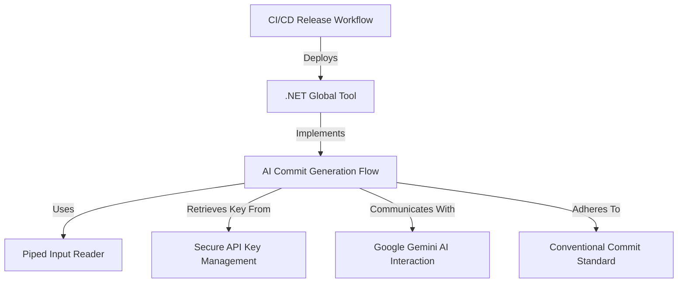
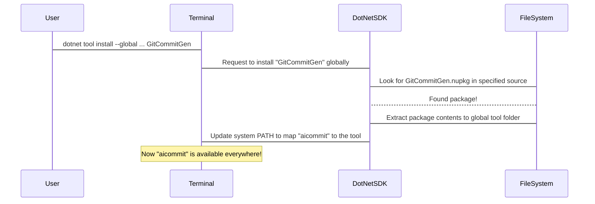
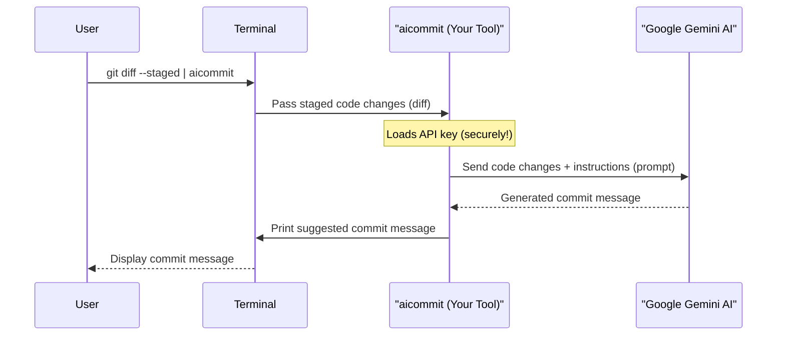
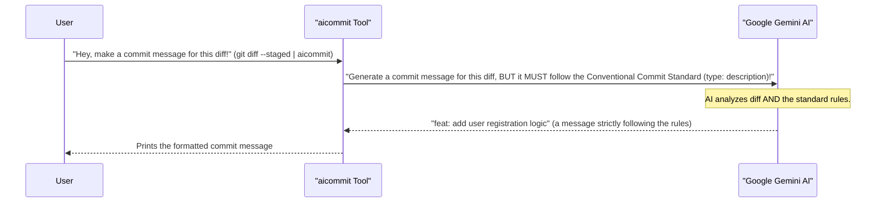
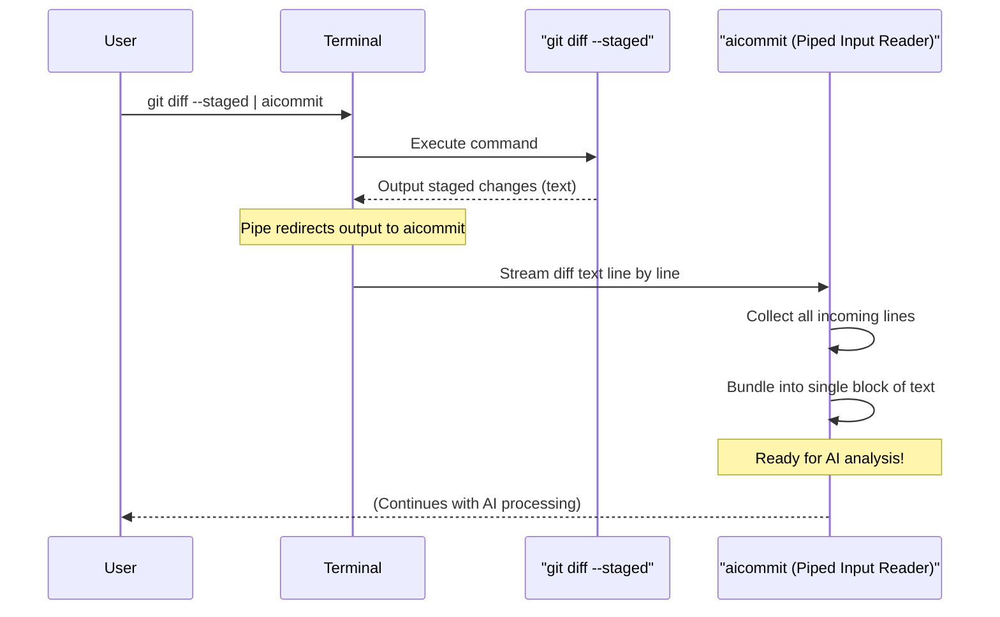
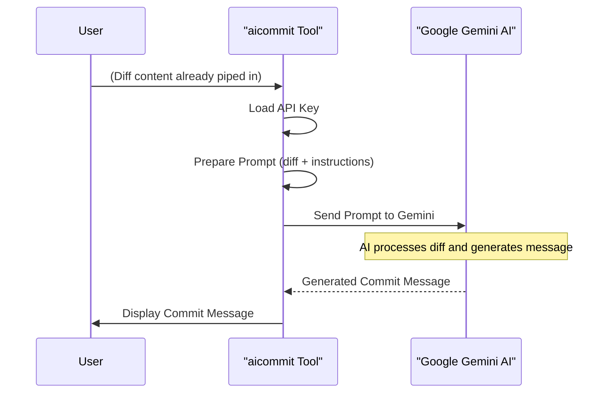
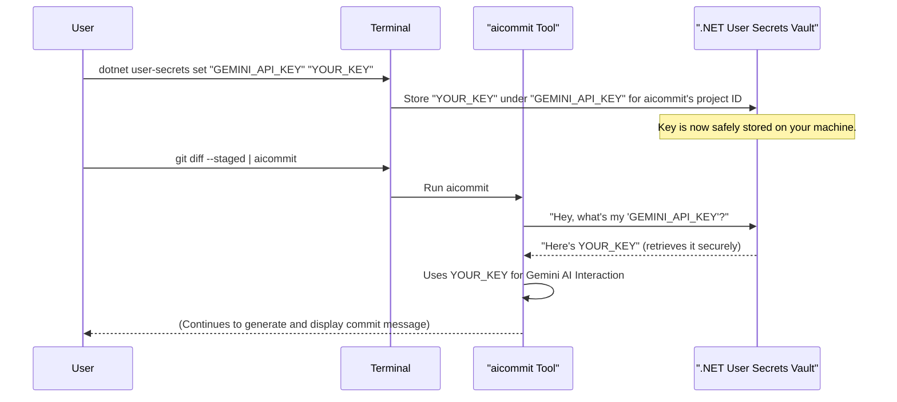
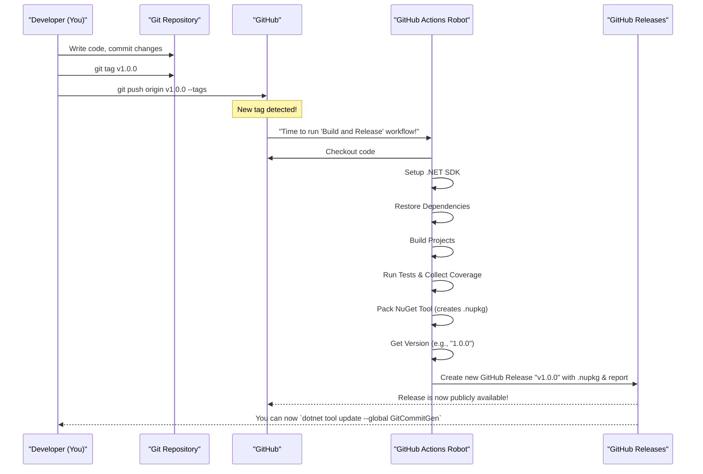

# 🤖 AI Commit Generator (.NET Global Tool)

### `aicommit`

This is a powerful command-line utility built with **.NET 8** and the **Google Gemini API**. It instantly generates concise, high-quality, and conventionally-formatted Git commit messages based on your staged code changes (`git diff --staged`).

It transforms a manual and often time-consuming step into a single, automated command.

---

## ✨ Features

* **AI-Powered:** Uses the `gemini-2.5-flash` model for intelligent analysis of code diffs.
* **Conventional Commits:** Generates messages strictly following the [Conventional Commits](https://www.conventionalcommits.org/en/v1.0.0/) specification (e.g., `feat: added user profile endpoint`).
* **Global Tool:** Once installed, it can be executed from **any directory** on your system using the simple command `aicommit`.
* **Secure:** Uses .NET User Secrets to securely handle your Gemini API key during development.

---

## 🚀 Installation and Setup

### Prerequisites

1.  **A Gemini API Key:** Get one from Google AI Studio.
2.  **Git:** Installed and available in your terminal.
3.  **.NET 8 SDK:** (or newer) installed on your system.

### Step 1: Securely Store Your API Key

The tool requires your Gemini API key to be available as an environment variable or stored in .NET User Secrets. For local use, User Secrets is highly recommended.

1.  Navigate to the `GitCommitGen` project folder in your terminal:
    ```bash
    cd C:\GitCommitGen
    ```
2.  Initialize User Secrets (if you haven't already):
    ```bash
    dotnet user-secrets init
    ```
3.  Set your API key:
    ```bash
    dotnet user-secrets set "GEMINI_API_KEY" "YOUR_API_KEY_HERE"
    ```

### Step 2: Build and Install the Global Tool

Run these two commands from the **`GitCommitGen`** directory to package the application and install it globally:

1.  **Pack the Project (creates the installable package):**
    ```bash
    dotnet pack -c Release
    ```
2.  **Install the Global Tool (named `aicommit`):**
    ```bash
    dotnet tool install --global --add-source ./nupkg GitCommitGen
    ```
    *(If you get an error that the tool is already installed, use `dotnet tool update` instead of `dotnet tool install`.)*

You should see a confirmation that the tool was successfully installed and can be invoked using `aicommit`.

---

## 💡 Usage

Once installed, use the command **`aicommit`** by piping (`|`) the output of `git diff --staged` into it. This command is run from **inside your target Git repository**.

### 1. Stage Your Changes

In your project folder, make and stage your file changes:

```bash
git add .
or
git add -A
```

### 2. Generate and Copy the Commit Message

Pipe the staged diff into the tool:

```bash
git diff --staged | aicommit
```
The tool will print the suggested commit message, for example:
```
🤖 Generating commit message based on your diff...

Suggested Commit Message:
feat: implement secure api key loading via user secrets
```

### 3. Commit

Copy the suggested message and use it directly as the commit message:

```bash
git commit -m "feat: implement secure api key loading via user secrets"
```

---

## 🧑‍💻 Contributing and Development

If you wish to work on the source code, you must manually update the global tool whenever you make changes.

1.  **Make changes to the code.**
    
2.  **Repack the project:**
    ```bash
    dotnet pack -c Release
    ```
3.  **Update the global tool:**
    ```bash
    dotnet tool update --global --add-source ./nupkg GitCommitGen
    ```
---

# Tutorial: GitCommitGen

`GitCommitGen` is a clever **command-line tool** that acts like your personal *AI assistant* for Git commits. It automatically generates high-quality, *conventionally formatted* commit messages by analyzing your staged code changes (`git diff`) and using the advanced **Google Gemini AI**. This makes committing much faster and ensures your project's commit history is clean and consistent.


## Visual Overview



## Chapters

1. [.NET Global Tool
](01__net_global_tool_.md)
2. [AI Commit Generation Flow
](02_ai_commit_generation_flow_.md)
3. [Conventional Commit Standard
](03_conventional_commit_standard_.md)
4. [Piped Input Reader
](04_piped_input_reader_.md)
5. [Google Gemini AI Interaction
](05_google_gemini_ai_interaction_.md)
6. [Secure API Key Management
](06_secure_api_key_management_.md)
7. [CI/CD Release Workflow
](07_ci_cd_release_workflow_.md)

---

# Chapter 1: .NET Global Tool

Imagine you're working on a project, and you want to use a special tool. Most of the time, you'd need to go to the folder where that tool is saved to run it. But wouldn't it be much easier if you could just type the tool's command, like `git` or `ls`, from *any* folder on your computer?

That's exactly the problem a **.NET Global Tool** solves!

Our `GitCommitGen` project, which helps you create Git commit messages with AI, works as a .NET Global Tool. This means you can type `aicommit` into your terminal no matter which project folder you're in, and it will just work!

## What is a .NET Global Tool?

Think of a **.NET Global Tool** like a superpower for your command-line programs. It's a special type of application built with Microsoft's .NET technology that you can install once on your computer. After installation, you can run it from *any directory* (any folder) using a simple, custom command name you define.

It's "global" because it's available everywhere on your system, not just in one specific folder.

## How to use `aicommit` as a Global Tool

Let's see how you install and use `GitCommitGen` (which we call `aicommit`) as a global tool.

### Step 1: Create the Tool Package (`dotnet pack`)

First, the `GitCommitGen` project needs to be "packaged" into a special file format that .NET understands. This package is called a NuGet package (it ends with `.nupkg`). You can create this package by running:

```bash
dotnet pack -c Release
```

*   `dotnet pack`: This command tells .NET to create a package from your project.
*   `-c Release`: This specifies that we want to build the "release" version of the tool, which is optimized for sharing and use.

After this, you'll find a new folder, `nupkg`, containing a file like `GitCommitGen.1.0.0.nupkg`. This is your installable tool!

### Step 2: Install it Globally (`dotnet tool install`)

Now that you have the package, you can tell .NET to install it globally. This makes the `aicommit` command available everywhere.

```bash
dotnet tool install --global --add-source ./nupkg GitCommitGen
```

*   `dotnet tool install`: This command instructs .NET to install a tool.
*   `--global`: This is the magic part! It tells .NET to make the tool available system-wide.
*   `--add-source ./nupkg`: This points to the folder where our `.nupkg` file was just created, so `dotnet` knows where to find our tool's package.
*   `GitCommitGen`: This is the actual name of our project/tool.

Once this command finishes successfully, you'll see a message confirming the installation. Now, you can simply type `aicommit` from any folder!

### Step 3: Run the Global Tool (`aicommit`)

To try it out, go to any folder on your computer (for example, a new Git repository you just cloned). Then, just type:

```bash
aicommit
```

You won't get a full AI commit message yet (we'll cover that in [AI Commit Generation Flow](02_ai_commit_generation_flow_.md)), but you should see a message from the `GitCommitGen` tool, perhaps asking for input or explaining its usage. The important part is that the command `aicommit` *ran*, even though you weren't in the `GitCommitGen` project folder!

## How it Works Under the Hood

When you install a .NET Global Tool, a few things happen:

1.  **Project Configuration:** The `.NET` project file (`.csproj`) for `GitCommitGen` contains special settings that tell .NET that this project should be treated as a global tool.
2.  **Packaging:** When you run `dotnet pack`, these settings are used to create the `.nupkg` file, which is essentially a compressed package containing your tool's executable code.
3.  **Global Installation:** When you run `dotnet tool install --global`, the .NET SDK takes this `.nupkg` package, extracts its contents, and places them in a special location on your computer. It then sets up your system's `PATH` (a list of directories where your terminal looks for commands) so that whenever you type `aicommit`, your computer knows to look in that special .NET global tools location and run `GitCommitGen.exe`.

Here's a simplified sequence of events during installation:



### The Project File's Role

The magic truly begins in the `GitCommitGen.csproj` file. This file tells .NET how to build and package our project. Let's look at the key lines that make it a global tool:

```xml
<Project Sdk="Microsoft.NET.Sdk">

  <PropertyGroup>
    <OutputType>Exe</OutputType>
    <TargetFramework>net8.0</TargetFramework>
    <!-- ... other settings ... -->
    <PackAsTool>true</PackAsTool>
    <ToolCommandName>aicommit</ToolCommandName>
    <PackageOutputPath>./nupkg</PackageOutputPath>
  </PropertyGroup>

  <!-- ... other items ... -->

</Project>
```

*   `<PackAsTool>true</PackAsTool>`: This line is crucial! It tells .NET, "Hey, this project isn't just a regular program; it's meant to be packaged as a .NET Global Tool."
*   `<ToolCommandName>aicommit</ToolCommandName>`: This line defines the friendly command name that users will type in their terminal to run our tool. In this case, it's `aicommit`.
*   `<PackageOutputPath>./nupkg</PackageOutputPath>`: This tells the `dotnet pack` command where to put the generated `.nupkg` file. We've set it to a folder named `nupkg` right within our project.

These few lines in the project file are all that's needed to transform a regular .NET console application into a powerful, globally accessible command-line tool. You can even see the `ci-release.yml` file, which is part of the project's automated release process, uses `dotnet pack` to create these tool packages automatically whenever a new version is released!

## Why a Global Tool?

Using a .NET Global Tool has several advantages:

| Feature               | Description                                                        | Benefit                                                                        |
| :-------------------- | :----------------------------------------------------------------- | :----------------------------------------------------------------------------- |
| **Global Availability** | Run the tool from *any* directory on your system.                  | No need to navigate to specific folders, works like `git` or `ls`.             |
| **Easy Distribution**   | Share your tool with others using a simple `dotnet tool install` command. | Simplifies installation for users, no complex setup.                           |
| **Simple Updates**      | Update to new versions with a single `dotnet tool update` command. | Keeps everyone on the latest version effortlessly.                             |
| **Clear Command Name**  | Use a memorable command like `aicommit`.                           | More user-friendly and intuitive than `dotnet run GitCommitGen.csproj`.        |

By making `GitCommitGen` a .NET Global Tool, we ensure it's incredibly convenient to use for anyone who wants to generate AI-powered commit messages in their projects.

## Conclusion

In this chapter, you learned that `GitCommitGen` is a **.NET Global Tool**, meaning you install it once and can then use the `aicommit` command from any folder on your computer. We explored how the `dotnet pack` and `dotnet tool install --global` commands work, and how the `GitCommitGen.csproj` file plays a crucial role in defining our tool's behavior.

Now that we understand *how* to run `aicommit` from anywhere, let's dive into *what* it actually does. In the next chapter, we'll explore the [AI Commit Generation Flow](02_ai_commit_generation_flow_.md) and see the steps involved in turning your code changes into a smart commit message!

<sub><sup>**References**: [[1]](https://github.com/UpenaNuhansi/GitCommitGen/blob/00cfa122406fd340d42b2eabcae413556c798965/.github/workflows/ci-release.yml), [[2]](https://github.com/UpenaNuhansi/GitCommitGen/blob/00cfa122406fd340d42b2eabcae413556c798965/GitCommitGen.csproj), [[3]](https://github.com/UpenaNuhansi/GitCommitGen/blob/00cfa122406fd340d42b2eabcae413556c798965/README.md)</sup></sub>

---

# Chapter 2: AI Commit Generation Flow

In the last chapter, you learned that `GitCommitGen` (our `aicommit` tool) is a handy [.NET Global Tool](01__net_global_tool_.md). This means you can run it from *anywhere* on your computer with a simple `aicommit` command. But what exactly happens when you run it? How does it magically turn your code changes into a smart commit message?

That's what the **AI Commit Generation Flow** is all about!

## The Problem: Tedious Commit Messages

Imagine you've just finished making some changes to your code. Before you save these changes permanently to your project's history (`git commit`), you need to write a commit message. This message explains *what* you changed and *why*.

Often, this can be a bit of a chore:
*   You have to remember all the little things you did.
*   You need to summarize them concisely.
*   You might want to follow a specific format (like [Conventional Commit Standard](03_conventional_commit_standard_.md)).
*   It takes time and mental effort, especially after a long coding session!

This is where `aicommit` shines! It's like having a smart assistant look at your changes and instantly draft the perfect commit message for you.

## What is the AI Commit Generation Flow?

The **AI Commit Generation Flow** is the entire step-by-step process that `aicommit` follows, from getting your code changes to giving you a polished commit message. It's the "brain" of the tool, orchestrating everything.

Think of it as a small assembly line:

1.  **Input:** You give it your new code changes.
2.  **Processing:** It sends these changes to a very smart AI.
3.  **Output:** The AI thinks about your changes and sends back a carefully worded commit message.

Let's look at the core use case that demonstrates this flow:

```bash
git diff --staged | aicommit
```

This single command triggers the entire flow! It tells `aicommit` to take your "staged" (ready-to-be-committed) code changes and ask an AI to describe them in a proper commit message.

## Breaking Down the Flow

The `aicommit` tool performs several key steps in sequence:

1.  **Receives Code Changes:** It gets the `git diff --staged` output as its input. (We'll see how this "piping" works in [Piped Input Reader](04_piped_input_reader_.md)).
2.  **Talks to AI:** It uses your secret API key to communicate with a powerful AI model (Google Gemini). (More on this in [Google Gemini AI Interaction](05_google_gemini_ai_interaction_.md)).
3.  **Crafts a Prompt:** It takes your code changes and wraps them into a special "question" for the AI, telling it exactly what kind of commit message to generate (e.g., following the [Conventional Commit Standard](03_conventional_commit_standard_.md)).
4.  **Gets AI Response:** The AI analyzes the code changes and generates a suggested commit message.
5.  **Presents Message:** It displays the generated commit message for you to use.

Let's see this in action with a typical example:

### Usage Example

Imagine you've added a new feature and staged your changes:

```bash
# You've made some changes and added them to the staging area
git add .
```

Now, instead of writing the commit message yourself, you run `aicommit`:

```bash
git diff --staged | aicommit
```

Here's what happens:

1.  `git diff --staged` finds all your changes ready for commit.
2.  The `|` (pipe) symbol sends these changes directly to `aicommit`.
3.  `aicommit` then uses AI to understand these changes.
4.  Finally, `aicommit` prints a suggested commit message like this:

```
🤖 Generating commit message based on your diff...

Suggested Commit Message:
feat: implement secure api key loading via user secrets
```

You can then simply copy this message and use it with `git commit -m "..."`.

## How it Works Under the Hood

Let's trace the journey of your code changes through `aicommit`.

### The Overall Sequence

This diagram shows the high-level steps involved when you run `git diff --staged | aicommit`:



### Diving into the Code (`Program.cs`)

The heart of this flow is within the `Program.cs` file of the `GitCommitGen` project. Let's walk through the important parts of the `Main` method, which executes these steps.

#### Step 1: Load API Key

First, `aicommit` needs your secret API key to talk to the Google Gemini AI. It loads this from a secure place.

```csharp
// Program.cs snippet
var config = new ConfigurationBuilder().AddUserSecrets<Program>().Build();
string? apiKey = config["GEMINI_API_KEY"];

if (string.IsNullOrEmpty(apiKey))
{
    // Error handling if key is missing
    Console.WriteLine("Error: GEMINI_API_KEY not found.");
    return;
}
```

This part ensures that `aicommit` can authenticate with Google's AI services. We'll explore how this key is managed securely in [Secure API Key Management](06_secure_api_key_management_.md).

#### Step 2: Read Piped Input

Next, `aicommit` waits for the `git diff --staged` output that you "piped" into it.

```csharp
// Program.cs snippet
string diffContent = await ReadPipedInputAsync();

if (string.IsNullOrWhiteSpace(diffContent))
{
    // Error handling if no diff is provided
    Console.WriteLine("No diff content provided.");
    return;
}
```

The `ReadPipedInputAsync()` method is a helper that captures all the text sent to `aicommit` through the pipe (`|`). You can learn more about this in [Piped Input Reader](04_piped_input_reader_.md).

#### Step 3: Prepare and Send to AI

With the API key and code changes in hand, `aicommit` initializes the AI client and crafts a specific instruction (a "prompt") for the AI.

```csharp
// Program.cs snippet
var client = new Client(apiKey: apiKey); // Initialize Gemini client

string prompt = $@"
    You are an expert software developer who writes perfect Git commit messages.
    // ... more instructions for the AI ...
    Here is the diff:
    ```diff
    {diffContent}
    ```
    Commit Message:
";

Console.WriteLine("🤖 Generating commit message based on your diff...");

var response = await client.Models.GenerateContentAsync(
    model: "gemini-2.5-flash",
    contents: prompt
);
```

Here:
*   `new Client(...)` creates an object to talk to the AI. This is detailed in [Google Gemini AI Interaction](05_google_gemini_ai_interaction_.md).
*   The `prompt` is a carefully worded message to the AI, containing your `diffContent` and telling the AI to generate a commit message following the [Conventional Commit Standard](03_conventional_commit_standard_.md).
*   `client.Models.GenerateContentAsync(...)` is the actual call to Google Gemini, sending the prompt and receiving the AI's response.

#### Step 4: Extract and Display the Message

Finally, `aicommit` takes the AI's response, cleans it up, and prints the suggested commit message to your terminal.

```csharp
// Program.cs snippet
string commitMessage = response.Candidates[0].Content.Parts[0].Text.Trim();

Console.WriteLine("\nSuggested Commit Message:");
Console.WriteLine(commitMessage);
```

This `commitMessage` is the gem you've been waiting for – a perfectly crafted Git commit message, ready for your repository!

## Why This Flow Matters

This automated flow brings several benefits:

| Feature                   | Description                                                                       | Benefit                                                                             |
| :------------------------ | :-------------------------------------------------------------------------------- | :---------------------------------------------------------------------------------- |
| **Automation**            | No manual writing of commit messages based on diffs.                              | Saves time and mental effort, especially for small, frequent commits.               |
| **Consistency**           | Always generates messages following the [Conventional Commit Standard](03_conventional_commit_standard_.md). | Improves project history readability and can be used for automated versioning.      |
| **Accuracy**              | AI analyzes the exact changes in your diff.                                       | Commit messages accurately reflect the code modifications.                          |
| **Integration**           | Seamlessly integrates with existing `git` commands using pipes.                   | Fits naturally into your existing developer workflow.                               |

By orchestrating these steps, `aicommit` transforms a manual, often tedious task into a quick, intelligent, and standardized operation.

## Conclusion

You've now got a good understanding of the **AI Commit Generation Flow**! You know that when you run `git diff --staged | aicommit`, your tool acts as a smart bridge: it grabs your code changes, sends them to an intelligent AI (Google Gemini) with clear instructions, and then presents you with a ready-to-use, perfectly formatted Git commit message.

This flow relies heavily on specific standards and technologies. In the next chapter, we'll dive deeper into one of the most important aspects of the output: the [Conventional Commit Standard](03_conventional_commit_standard_.md) and why it's so valuable.


<sub><sup>**References**: [[1]](https://github.com/UpenaNuhansi/GitCommitGen/blob/00cfa122406fd340d42b2eabcae413556c798965/GitCommitGen.csproj), [[2]](https://github.com/UpenaNuhansi/GitCommitGen/blob/00cfa122406fd340d42b2eabcae413556c798965/Program.cs), [[3]](https://github.com/UpenaNuhansi/GitCommitGen/blob/00cfa122406fd340d42b2eabcae413556c798965/README.md)</sup></sub>
---
# Chapter 3: Conventional Commit Standard

In the previous chapter, [AI Commit Generation Flow](02_ai_commit_generation_flow_.md), you learned how our `aicommit` tool magically takes your code changes, sends them to an AI, and gets back a suggested commit message. But have you ever noticed that these generated messages always have a specific look? They aren't just random sentences; they follow a clear pattern, like `feat: add user login endpoint` or `fix: resolve display bug`.

This consistent pattern isn't accidental! It's because `aicommit` uses a very important "rulebook" called the **Conventional Commit Standard**.

## The Problem: Messy Commit Histories

Imagine you're reading a book where every chapter title is written differently. Some are long, some are short, some use emojis, some are just a single word. It would be really hard to quickly understand what each chapter is about, right?

The same goes for Git commit messages in a project:
*   **Inconsistent messages** make it hard to quickly scan the project history and understand what happened when.
*   **Vague messages** like "updates" or "changes" don't tell you anything useful.
*   **Different styles** from different team members can make the history feel unorganized.
*   **Automated tools** (like ones that create release notes) can't understand unstructured messages.

This "messy history" problem is what the **Conventional Commit Standard** solves!

## What is the Conventional Commit Standard?

The **Conventional Commit Standard** is like a universal "recipe" or "rulebook" for writing Git commit messages. It's not a piece of code you run, but rather a widely accepted guideline that dictates the *exact format* of a commit message.

Its main goal is to make commit messages:
1.  **Consistent:** Everyone writes them the same way.
2.  **Readable:** Easy for humans to understand quickly.
3.  **Machine-Parsable:** Easy for computer programs to understand and use (for things like generating changelogs or automating version bumps).

For `GitCommitGen`, this standard is **crucial** because it's the recipe the AI *must* follow when generating commit messages.

### The Basic Recipe: `type: description`

The core of the Conventional Commit Standard is a simple, yet powerful, format:

```
type: description
```

Let's break down each part:

*   **`type`**: This tells you *what kind* of change this commit introduces. It's a short, lowercase word.
*   **`:` (colon)**: A separator, always followed by a space.
*   **` ` (space)**: Required after the colon.
*   **`description`**: A very brief, concise summary of the change, also in lowercase. It should start with a verb (e.g., `add`, `fix`, `refactor`).

### Common `type`s you'll see:

| Type        | Meaning                                                     | Example                                           |
| :---------- | :---------------------------------------------------------- | :------------------------------------------------ |
| `feat`      | A new feature has been added.                               | `feat: add user profile page`                     |
| `fix`       | A bug has been fixed.                                       | `fix: prevent crash on empty input`               |
| `chore`     | Regular maintenance, build updates, or tool changes.        | `chore: update npm dependencies`                  |
| `docs`      | Changes related to documentation only.                      | `docs: update readme with installation steps`     |
| `style`     | Changes that do not affect the meaning of the code (e.g., whitespace, formatting, missing semicolons). | `style: format code according to prettier rules`  |
| `refactor`  | A code change that neither fixes a bug nor adds a feature (e.g., restructuring existing code). | `refactor: extract helper function for data processing` |
| `test`      | Adding missing tests or correcting existing tests.          | `test: add unit tests for validation logic`       |

Our `aicommit` tool is specifically instructed to use this standard, which is why its output is always so predictable!

## How `aicommit` Uses the Standard

When you run `git diff --staged | aicommit`, the tool doesn't just ask the AI to "write a commit message." It gives the AI very specific instructions, including the requirement to follow the Conventional Commit Standard.

Let's look at a simple example:

```bash
# Imagine you added a new user registration feature and staged your changes
git add .
```

Now, you run `aicommit`:

```bash
git diff --staged | aicommit
```

`aicommit` will process your changes and print something like this:

```
🤖 Generating commit message based on your diff...

Suggested Commit Message:
feat: implement secure user registration endpoint
```

Notice how the suggested message perfectly fits the `type: description` format:
*   **`feat`**: The type, indicating a new feature.
*   **`:`**: The colon.
*   **` `**: The space.
*   **`implement secure user registration endpoint`**: The concise description of the new feature.

This adherence to the standard makes the generated message immediately useful and understandable.

## Under the Hood: The AI's Instructions

The `aicommit` tool ensures the AI follows the standard by including clear instructions in the "prompt" it sends to Google Gemini. This is like giving a chef a recipe card with precise steps for a dish.

Here's a simplified look at how the `Program.cs` file crafts these instructions:

```csharp
// Program.cs snippet (simplified)
string prompt = $@"
    You are an expert software developer who writes perfect Git commit messages.
    Based on the following 'git diff' output, generate a concise and descriptive
    commit message following the Conventional Commits specification.

    The commit message should have a 'type' (e.g., feat, fix, docs, chore, refactor)
    followed by a short description, all in lowercase.
    Do not include a message body or footer, just the single-line header.

    Example: feat: add user authentication endpoint

    Here is the diff:
    ```diff
    // ... your code changes (diffContent) ...
    ```

    Commit Message:
";
// ... code that sends this prompt to Google Gemini ...
```

This snippet from `Program.cs` is the "rulebook" given to the AI. It specifically tells Gemini:
1.  **To be an expert developer** writing commit messages.
2.  **To follow the "Conventional Commits specification."**
3.  **The exact format**: `type` (e.g., `feat`, `fix`), colon, space, and a description, all in lowercase.
4.  **No extra body or footer**, just the single-line header.
5.  **An example** (`feat: add user authentication endpoint`) for clarity.

This direct instruction is how `aicommit` guarantees consistent output.

### The Standard in Action

Here's a simplified sequence of how the standard influences the flow:



## Why the Conventional Commit Standard Matters for You

Using this standard, especially with `aicommit`, brings significant benefits:

| Feature                   | Description                                                                       | Benefit for You                                                                      |
| :------------------------ | :-------------------------------------------------------------------------------- | :----------------------------------------------------------------------------------- |
| **Consistency**           | All commit messages follow the same `type: description` format.                     | Easy to scan and understand your project's history at a glance.                      |
| **Clarity & Readability** | The `type` immediately tells you the *purpose* of the change.                      | Quickly grasp if a commit is a new feature, a bug fix, or just maintenance.          |
| **Collaboration**         | Everyone on a team understands what each commit means.                            | Improves communication and makes code reviews easier for larger teams.               |
| **Automation Potential**  | Tools can automatically generate changelogs or manage versioning based on `type`. | While `aicommit` doesn't do this directly, it enables other tools to work with your commits. |
| **Effortless Adherence**  | `aicommit` handles the formatting for you.                                        | You get all the benefits of the standard without needing to remember the rules yourself! |

By leveraging the Conventional Commit Standard, `GitCommitGen` makes your project's history cleaner, more understandable, and more professional, all with minimal effort from you.

## Conclusion

You've now learned about the **Conventional Commit Standard**! It's the essential "rulebook" that dictates the `type: description` format of the commit messages `aicommit` generates. This standard ensures consistency, readability, and machine-readability for all your commits.

Understanding this standard helps you appreciate why `aicommit`'s output looks the way it does and why it's so valuable. In the next chapter, we'll dive into another crucial piece of the puzzle: how `aicommit` actually *receives* your code changes when you "pipe" them in. Get ready to explore the [Piped Input Reader](04_piped_input_reader_.md)!

<sub><sup>**References**: [[1]](https://github.com/UpenaNuhansi/GitCommitGen/blob/00cfa122406fd340d42b2eabcae413556c798965/CommitGenerator.cs), [[2]](https://github.com/UpenaNuhansi/GitCommitGen/blob/00cfa122406fd340d42b2eabcae413556c798965/GitCommitGen.Tests/UnitTest1.cs), [[3]](https://github.com/UpenaNuhansi/GitCommitGen/blob/00cfa122406fd340d42b2eabcae413556c798965/Program.cs), [[4]](https://github.com/UpenaNuhansi/GitCommitGen/blob/00cfa122406fd340d42b2eabcae413556c798965/README.md)</sup></sub>

---
# Chapter 4: Piped Input Reader

In the last chapter, [Conventional Commit Standard](03_conventional_commit_standard_.md), you learned about the structured format that `aicommit` uses for its generated messages. But before `aicommit` can *generate* a message, it first needs to *know* what code changes you've made!

This is where the **Piped Input Reader** comes in. It's like the tool's specialized "ear," patiently listening for information coming from another program. Without this crucial part, `aicommit` wouldn't have any code changes to analyze, and therefore, couldn't generate a commit message.

## The Problem: How Does `aicommit` See Your Changes?

Imagine you're talking to a friend, but they can't hear you. You're explaining something, but the information isn't reaching them.

Similarly, when you make changes to your code, `aicommit` doesn't automatically "see" them. It's a separate program, and it needs a way for your `git` commands to "talk" to it.

Consider our core use case:

```bash
git diff --staged | aicommit
```

Here:
*   `git diff --staged` is busy figuring out all the changes you've prepared for your next commit.
*   `aicommit` is waiting to do its AI magic.

The big question is: How does the text output from `git diff --staged` actually get *into* `aicommit`? This is the problem the **Piped Input Reader** solves.

## What is a Piped Input Reader?

A **Piped Input Reader** is a special part of a program designed to capture text (or "input") that is sent to it from *another* program using a "pipe."

Think of a **pipe** (`|`) in your command line like a physical pipe connecting two programs. The program on the left (`git diff --staged`) pours its output (the code changes) into the pipe, and the program on the right (`aicommit`) has a special "reader" to collect everything that flows out of the pipe.

Our `aicommit` tool's Piped Input Reader does two main things:
1.  **Listens:** It patiently waits for any text to be sent its way through the pipe.
2.  **Collects:** It gathers *all* the incoming text, line by line, until there's nothing left.
3.  **Bundles:** Once all the text is received, it bundles it up into a single block of text (the "diff content") so that the AI can analyze your staged code changes.

## How `aicommit` Uses Piped Input

Let's revisit our key command:

```bash
git diff --staged | aicommit
```

Here’s what happens step-by-step, with the Piped Input Reader playing a central role:

1.  **`git diff --staged` runs:** This command inspects your Git repository and generates a detailed text output of all the files and lines you've changed and "staged" (marked as ready to be committed). This output looks like a big block of text.
2.  **The `|` (pipe) acts:** Instead of printing the `git diff` output to your screen, the pipe symbol (`|`) redirects it. It says, "Don't show this to the user; send it as input to the next command!"
3.  **`aicommit`'s Piped Input Reader listens:** Our `aicommit` tool starts up, and its Piped Input Reader immediately checks if there's any incoming text through a pipe. It finds the diff content flowing in.
4.  **Content is collected:** The Piped Input Reader continuously reads every line of the `git diff` output until the pipe closes (meaning `git diff --staged` has finished sending all its output).
5.  **AI gets the bundle:** Once all the diff content is collected, `aicommit` takes this complete block of text and sends it to the AI for analysis, as described in the [AI Commit Generation Flow](02_ai_commit_generation_flow_.md).

### Visualizing the Flow



## Under the Hood: The `ReadPipedInputAsync` Method

The magic of reading piped input is handled by a special helper method in `Program.cs` called `ReadPipedInputAsync`. Let's break down how it works:

### Checking for Piped Input

First, the program needs to know if it's actually receiving input through a pipe or if it's just being run normally (without any piped data).

```csharp
// Program.cs snippet
private static async Task<string> ReadPipedInputAsync()
{
    // Checks if input is coming from a pipe, not directly from the keyboard
    if (!Console.IsInputRedirected)
    {
        return string.Empty; // No pipe, no input
    }

    // ... code to read input ...
}
```
*   `Console.IsInputRedirected`: This is a .NET feature that tells us if the program's standard input is coming from somewhere other than the keyboard (like a pipe or a file). If it's `false`, there's no piped input, so the method returns an empty string.

### Collecting the Input

If input *is* redirected, the method then proceeds to read all the lines of text coming through the pipe until there are no more.

```csharp
// Program.cs snippet (simplified)
private static async Task<string> ReadPipedInputAsync()
{
    if (!Console.IsInputRedirected)
    {
        return string.Empty;
    }

    // A smart way to build a big string from many smaller strings
    var stringBuilder = new StringBuilder();
    string? line;

    // Read lines until there are no more (the pipe closes)
    while ((line = await Console.In.ReadLineAsync()) != null)
    {
        stringBuilder.AppendLine(line); // Add each line to our builder
    }
    return stringBuilder.ToString(); // Return the complete text
}
```

*   `var stringBuilder = new StringBuilder();`: Imagine `StringBuilder` as a super-efficient notebook. Instead of writing separate sentences on many tiny pieces of paper, you add all your sentences to one continuous page. This is much faster when you're collecting lots of text.
*   `string? line;`: This declares a variable to hold each line of text as it's read.
*   `while ((line = await Console.In.ReadLineAsync()) != null)`: This is the heart of the reader!
    *   `Console.In.ReadLineAsync()`: This command reads one full line of text from the input stream (our pipe). The `Async` part means it can do this without freezing the entire program while it waits for the next line.
    *   The `while` loop continues to read lines one by one. It stops when `ReadLineAsync()` returns `null`, which signals that there's no more input coming from the pipe.
*   `stringBuilder.AppendLine(line);`: Each line that is read is added to our `stringBuilder`.
*   `return stringBuilder.ToString();`: Once the loop finishes, all the collected lines are combined into one big string, which is then returned. This complete string is your `diffContent`.

This `ReadPipedInputAsync` method is called directly in our `Program.cs` file, right after loading the API key:

```csharp
// Program.cs snippet
// ... (API key loading) ...

// 2. Read input from the console (piped from 'git diff')
string diffContent = await ReadPipedInputAsync();

if (string.IsNullOrWhiteSpace(diffContent))
{
    Console.ForegroundColor = ConsoleColor.Yellow;
    Console.WriteLine("No diff content provided. Did you forget to pipe it?");
    Console.WriteLine("Usage: git diff --staged | aicommit"); // Changed from dotnet run
    Console.ResetColor();
    return;
}

// ... (Rest of the AI generation flow) ...
```

If `diffContent` is empty, it means no diff was piped, and `aicommit` will kindly remind you how to use it!

## Why Piped Input Matters for `aicommit`

Using this Piped Input Reader design for `aicommit` offers several important advantages:

| Feature                  | Description                                                             | Benefit                                                                        |
| :----------------------- | :---------------------------------------------------------------------- | :----------------------------------------------------------------------------- |
| **Seamless Integration** | Works directly with standard shell commands like `git diff`.            | Fits naturally into your existing Git workflow without special setup.          |
| **Flexibility**          | Can receive input from *any* program that outputs text to the console.  | Not limited to `git diff`; could potentially be used with other tools.         |
| **Automation Power**     | Enables chaining commands together in a powerful, automated sequence.   | Turns a two-step process (diff then copy/paste) into a single, automated command. |
| **Simplicity for User**  | No need to save diffs to temporary files or copy-paste manually.        | Reduces manual steps and potential for errors, making the tool easy to use.    |

This Piped Input Reader is a fundamental piece that allows `aicommit` to truly act as a helpful command-line assistant, seamlessly integrated into your developer toolkit.

## Conclusion

You've now uncovered the mystery behind how `aicommit` receives your code changes! The **Piped Input Reader** is the dedicated component that diligently captures all the output from commands like `git diff --staged` when you use the `|` (pipe) symbol. It bundles this information into a single, usable block of text, which is then ready for the next crucial step: AI analysis.

Now that `aicommit` has your code changes in hand, what does it do with them? It sends them off to a very smart brain! In the next chapter, we'll explore how `GitCommitGen` interacts with the powerful [Google Gemini AI Interaction](05_google_gemini_ai_interaction_.md) to generate those brilliant commit messages.

<sub><sup>**References**: [[1]](https://github.com/UpenaNuhansi/GitCommitGen/blob/00cfa122406fd340d42b2eabcae413556c798965/Program.cs), [[2]](https://github.com/UpenaNuhansi/GitCommitGen/blob/00cfa122406fd340d42b2eabcae413556c798965/README.md)</sup></sub>
---
# Chapter 5: Google Gemini AI Interaction

In the last chapter, [Piped Input Reader](04_piped_input_reader_.md), you learned how `aicommit` cleverly *receives* your code changes using a pipe (`|`). It patiently waits for `git diff --staged` to send all your modified lines, bundles them up, and then holds them, ready for the next step.

But what happens next? How does a raw bunch of code changes suddenly become a perfectly crafted commit message like `feat: add user login endpoint`? This is where the **Google Gemini AI Interaction** comes in! It's the "brain" of our `aicommit` tool, where the real "AI magic" happens.

## The Problem: Making Sense of Code Changes

Imagine you've just spent hours coding, adding a new feature. You have many changed lines across several files. Now, you need to write a commit message that summarizes all of it clearly and concisely, following rules like the [Conventional Commit Standard](03_conventional_commit_standard_.md).

This can be a real challenge:
*   You might miss important details in the diff.
*   It's easy to forget to follow the standard format consistently.
*   It takes extra mental effort after coding.

We need an intelligent assistant that can look at the code changes, understand their meaning, and then write a summary for us.

## What is Google Gemini AI Interaction?

The **Google Gemini AI Interaction** is the direct communication channel between our `aicommit` tool and Google's powerful Gemini AI model. It's like having a skilled translator and writer built right into `aicommit`.

Here’s what it does:
1.  **Takes your "question"**: `aicommit` bundles your code changes (the diff) and a specific set of instructions (called a "prompt") into a "question" for Gemini.
2.  **Sends it to Gemini**: This "question" is sent over the internet to Google's super-smart AI servers.
3.  **Waits for "answer"**: Gemini processes your code changes and instructions, thinking deeply about them.
4.  **Brings back the "answer"**: Gemini then generates a creative and relevant response – your suggested commit message – and sends it back to `aicommit`.

This is the core of `GitCommitGen`, transforming raw code differences into human-readable, standardized summaries.

## How `aicommit` Uses Google Gemini

Let's revisit our main command to see how this interaction fits in:

```bash
git diff --staged | aicommit
```

By the time the `aicommit` tool receives the diff content (thanks to the [Piped Input Reader](04_piped_input_reader_.md)), it has all the information it needs to talk to the AI.

Here's the simplified sequence of events:

1.  **`aicommit` has the code changes (diff).**
2.  **`aicommit` also has your secret API key** (which allows it to talk to Google's services, more on this in [Secure API Key Management](06_secure_api_key_management_.md)).
3.  **`aicommit` creates a "prompt"**: This is a detailed instruction for the AI, combining your diff with rules like "act as an expert developer" and "follow the [Conventional Commit Standard](03_conventional_commit_standard_.md)."
4.  **`aicommit` sends the prompt to Google Gemini.**
5.  **Google Gemini analyzes the diff and generates a commit message.**
6.  **Google Gemini sends the message back to `aicommit`.**
7.  **`aicommit` displays the message to you.**

### Visualizing the AI Interaction



## Under the Hood: The Code That Talks to AI

Let's look at the key parts in `Program.cs` that make this interaction happen.

### 1. The `Google.GenAI` Package

First, our project needs a way to easily talk to Google Gemini. This is done through a special library (or "package") called `Google.GenAI`. You can see it listed in our project file:

--- File: GitCommitGen.csproj ---
```xml
<Project Sdk="Microsoft.NET.Sdk">

  <PropertyGroup>
    <!-- ... other settings ... -->
  </PropertyGroup>

  <ItemGroup>
    <PackageReference Include="Google.GenAI" Version="0.3.0" />
    <!-- ... other packages ... -->
  </ItemGroup>

</Project>
```
*   `<PackageReference Include="Google.GenAI" Version="0.3.0" />`: This line tells our project to download and use the `Google.GenAI` library, which provides all the tools needed to send requests to Google Gemini.

### 2. Initializing the Gemini Client

In `Program.cs`, once `aicommit` has your API key (loaded in step 1 of the [AI Commit Generation Flow](02_ai_commit_generation_flow_.md)), it uses it to set up the communication channel:

--- File: Program.cs ---
```csharp
// Program.cs snippet
// ... (API key loading and diff content reading) ...

try
{
    // 3. Initialize the Gemini client
    var client = new Client(apiKey: apiKey);

    // ... (rest of the AI interaction) ...
}
catch (Exception ex)
{
    // ... error handling ...
}
```
*   `var client = new Client(apiKey: apiKey);`: This line creates a `Client` object from the `Google.GenAI` library. Think of `client` as the "messenger" that will carry your request to Gemini. It needs your `apiKey` to prove that `aicommit` is allowed to talk to Gemini.

### 3. Crafting the AI "Prompt"

This is a very important step! The "prompt" is the detailed instruction `aicommit` gives to Gemini. It's not just the diff; it also tells Gemini *what kind* of commit message to generate.

--- File: Program.cs ---
```csharp
// Program.cs snippet
// ... (client initialization) ...

    // 4. Create a specific prompt for the AI
    string prompt = $@"
        You are an expert software developer who writes perfect Git commit messages.
        Based on the following 'git diff' output, generate a concise and descriptive
        commit message following the Conventional Commits specification.

        The commit message should have a 'type' (e.g., feat, fix, docs, chore, refactor)
        followed by a short description, all in lowercase.
        Do not include a message body or footer, just the single-line header.

        Example: feat: add user authentication endpoint

        Here is the diff:
        ```diff
        {diffContent}
        ```

        Commit Message:
    ";

    Console.ForegroundColor = ConsoleColor.Cyan;
    Console.WriteLine("🤖 Generating commit message based on your diff...");
    Console.ResetColor();

    // ... (call to Gemini API) ...
```
*   `string prompt = $@"...";`: This creates a long string containing all the instructions.
*   **"You are an expert software developer..."**: This sets the "role" for the AI, encouraging it to think like a seasoned developer.
*   **"...following the Conventional Commits specification."**: This is crucial! It tells Gemini to strictly follow the rules we learned in [Conventional Commit Standard](03_conventional_commit_standard_.md).
*   **"Do not include a message body or footer..."**: This ensures we get just the single-line commit message we want.
*   **"Example: feat: add user authentication endpoint"**: Giving an example helps the AI understand the desired output format even better.
*   **"Here is the diff: ```diff {diffContent} ```"**: Finally, the actual code changes (`diffContent`) are included, neatly formatted for the AI to understand.
*   **"Commit Message:"**: This hints to the AI that the *next* thing it should output is the commit message.

### 4. Calling the Gemini API

With the client ready and the prompt crafted, `aicommit` sends the request to Google Gemini:

--- File: Program.cs ---
```csharp
// Program.cs snippet
// ... (prompt creation) ...

    // 5. Call the Gemini API model
    var response = await client.Models.GenerateContentAsync(
        model: "gemini-2.5-flash", 
        contents: prompt            
    );

    // ... (processing response) ...
```
*   `await client.Models.GenerateContentAsync(...)`: This is the actual call to Gemini!
    *   `model: "gemini-2.5-flash"`: This specifies *which* Gemini AI model to use. `gemini-2.5-flash` is a fast and efficient model suitable for this task.
    *   `contents: prompt`: This sends our carefully prepared `prompt` to the AI.
*   `var response = ...`: The result from Gemini (the generated commit message, along with other information) is stored in the `response` variable.

### 5. Extracting and Displaying the Message

Once `aicommit` receives the `response` from Gemini, it needs to grab just the actual commit message text and show it to you.

--- File: Program.cs ---
```csharp
// Program.cs snippet
// ... (call to Gemini API) ...

    // 6. Print the clean response
    // Access the text through Candidates -> Content -> Parts
    string commitMessage = response.Candidates[0].Content.Parts[0].Text.Trim();
    
    Console.ForegroundColor = ConsoleColor.Green;
    Console.WriteLine("\nSuggested Commit Message:");
    Console.ResetColor();
    Console.WriteLine(commitMessage);

// ... (error handling) ...
```
*   `response.Candidates[0].Content.Parts[0].Text`: The Gemini response object has a structured way of delivering information. This line digs into that structure to get to the actual text of the AI's generated content, which is our commit message.
*   `.Trim()`: This simply removes any extra spaces or newlines from the beginning or end of the message, ensuring it looks clean.
*   `Console.WriteLine(commitMessage);`: Finally, `aicommit` prints the beautiful, AI-generated commit message for you!

## Why This AI Interaction Matters

This direct communication with Google Gemini is the heart of `aicommit`. It provides crucial benefits:

| Feature                   | Description                                                                    | Benefit                                                                      |
| :------------------------ | :----------------------------------------------------------------------------- | :--------------------------------------------------------------------------- |
| **Intelligent Summaries** | AI understands code changes and condenses them into meaningful descriptions.   | No more manual effort in summarizing complex diffs.                          |
| **Standard Adherence**    | Gemini is instructed to follow the [Conventional Commit Standard](03_conventional_commit_standard_.md). | Guarantees consistent, professional-looking commit messages every time.      |
| **Contextual Awareness**  | The AI uses the full `git diff` content to generate a highly relevant message. | Commit messages are accurate and reflect the true nature of your changes.    |
| **Creative Suggestions**  | Gemini can propose commit types and descriptions you might not have considered. | Helps improve the quality and detail of your commit history.                 |
| **Efficiency**            | Automates a repetitive task.                                                   | Speeds up your development workflow, letting you focus on coding.            |

By elegantly connecting your `git diff` output to Google's powerful AI, `aicommit` truly leverages the best of modern technology to simplify your daily development tasks.

## Conclusion

You've now explored the core of `GitCommitGen`: the **Google Gemini AI Interaction**! You understand that `aicommit` acts as a clever messenger, taking your code changes, crafting a precise "prompt," sending it to Google Gemini, and then bringing back a perfectly formatted, AI-generated commit message. This interaction is where raw code becomes an intelligent summary.

However, for `aicommit` to talk to Google Gemini, it needs a special "key" – an API key. And managing this key securely is super important! In the next chapter, we'll dive into how `GitCommitGen` handles this with [Secure API Key Management](06_secure_api_key_management_.md).

<sub><sup>**References**: [[1]](https://github.com/UpenaNuhansi/GitCommitGen/blob/00cfa122406fd340d42b2eabcae413556c798965/GitCommitGen.csproj), [[2]](https://github.com/UpenaNuhansi/GitCommitGen/blob/00cfa122406fd340d42b2eabcae413556c798965/Program.cs)</sup></sub>
---
# Chapter 6: Secure API Key Management

In the last chapter, [Google Gemini AI Interaction](05_google_gemini_ai_interaction_.md), you learned how `aicommit` talks directly to Google's powerful Gemini AI to generate commit messages. But for `aicommit` to do this, it needs a special "permission slip" called an **API key**. This key is like a secret password that proves `aicommit` is allowed to use Gemini's services.

However, an API key is very sensitive information. If it falls into the wrong hands, someone else could use your key and potentially spend your AI credits! This brings us to a crucial concept: **Secure API Key Management**.

## The Problem: Keeping Your Secrets Secret

Imagine you have a very important key to your house. You wouldn't want to write it on a sticky note and leave it on your front door, right? Similarly, you wouldn't want to write your Gemini API key directly into your code and then share that code on a public platform like GitHub.

Here's why exposing your API key is a big problem:
*   **Security Risk:** Others could use your key, leading to unauthorized access and charges.
*   **Accidental Leaks:** It's very easy to accidentally commit your key to a public repository if it's hardcoded into your project.
*   **Configuration Clutter:** Hardcoding keys means you'd have to change your code every time the key changes.

We need a safe place to store this secret key, a place where it can be used by `aicommit` but remains hidden from public view and isn't accidentally shared.

## What is Secure API Key Management?

For `GitCommitGen`, **Secure API Key Management** means using a special feature in .NET called **User Secrets**. Think of User Secrets as a small, personal, encrypted digital vault on *your development machine*. It's specifically designed for storing sensitive bits of information (like API keys) that your application needs during development, without ever putting them directly into your project's code files.

Here's what it helps us achieve:
1.  **Protection:** Your sensitive Gemini API key is stored outside of your project's source code.
2.  **Prevention:** It stops your key from being accidentally committed to public code repositories (like GitHub).
3.  **Accessibility:** Your `aicommit` tool can still securely retrieve and use the key when it needs to talk to Google Gemini.

## How `aicommit` Uses User Secrets

The flow is simple: You (the developer) put your secret key into this special vault once. Then, whenever `aicommit` runs, it knows how to open that vault and get the key, without you having to type it in every time or risking it being exposed.

### Your Use Case: Setting and Using the Key

Let's see how you, as a user, would manage your Gemini API key for `aicommit`.

#### Step 1: Initialize Your Secret Vault

First, you need to tell .NET to create this "secret vault" for your project. You do this once for each project you want to use User Secrets with.

Navigate to the `GitCommitGen` project folder in your terminal:
```bash
cd C:\GitCommitGen
```

Then, initialize the User Secrets:
```bash
dotnet user-secrets init
```
*   `dotnet user-secrets init`: This command creates a unique ID for your project and sets up a place on your computer where secrets for *this specific project* will be stored. You'll typically find this vault in a hidden folder outside your project, like `C:\Users\<YourUsername>\AppData\Roaming\Microsoft\UserSecrets\<YourSecretId>`.

#### Step 2: Store Your API Key in the Vault

Now, you tell .NET to put your actual Gemini API key into that vault.

```bash
dotnet user-secrets set "GEMINI_API_KEY" "YOUR_API_KEY_HERE"
```
*   `dotnet user-secrets set`: This command is like telling the vault, "Please store this item."
*   `"GEMINI_API_KEY"`: This is the name we've given to our secret key. `aicommit` will use this name to ask for the key later.
*   `"YOUR_API_KEY_HERE"`: This is where you paste your actual, secret Gemini API key that you got from Google AI Studio.

After these two steps, your API key is safely tucked away! You only need to do this once.

#### Step 3: `aicommit` Securely Retrieves and Uses the Key

Now, when you run `aicommit`, it will automatically look for the `GEMINI_API_KEY` in its User Secrets vault. You don't do anything extra!

```bash
git diff --staged | aicommit
```

What happens here (behind the scenes):
1.  `aicommit` starts.
2.  It asks the .NET runtime, "Hey, can you get me the secret named `GEMINI_API_KEY` from my vault?"
3.  .NET looks up the project's unique ID, finds the corresponding vault on your machine, retrieves the key.
4.  `aicommit` now has the key in its memory and can use it to talk to Google Gemini, as described in [Google Gemini AI Interaction](05_google_gemini_ai_interaction_.md).
5.  The key is never written into a public file or accidentally shared.

## Under the Hood: The User Secrets Mechanism

Let's peek at how `GitCommitGen` is set up and how it retrieves the key.

### The Overall Sequence

When `aicommit` runs, here's how it interacts with User Secrets to get your key:



### The Project File's Role (`GitCommitGen.csproj`)

To enable User Secrets for `GitCommitGen`, two important pieces are added to the `.csproj` file:

--- File: GitCommitGen.csproj ---
```xml
<Project Sdk="Microsoft.NET.Sdk">

  <PropertyGroup>
    <!-- ... other settings ... -->
    <UserSecretsId>191fd02d-42be-46e2-a7d2-789a1e508e9a</UserSecretsId>
    <!-- ... other settings ... -->
  </PropertyGroup>

  <ItemGroup>
    <PackageReference Include="Google.GenAI" Version="0.3.0" />
    <PackageReference Include="Microsoft.Extensions.Configuration.UserSecrets" Version="9.0.10" />
  </ItemGroup>

</Project>
```
*   `<UserSecretsId>191fd02d-42be-46e2-a7d2-789a1e508e9a</UserSecretsId>`: This is a unique identifier (a GUID) that acts like a specific lock on *this project's* vault. When you run `dotnet user-secrets init`, if this ID isn't present, it generates one and adds it here. This ID tells .NET *which* vault to look into when `aicommit` asks for secrets.
*   `<PackageReference Include="Microsoft.Extensions.Configuration.UserSecrets" Version="9.0.10" />`: This line tells our project to include the necessary library that provides the User Secrets functionality. Without this, `aicommit` wouldn't know how to talk to the User Secrets vault.

### The Code That Reads the Key (`Program.cs`)

In `Program.cs`, the very first thing `aicommit` does is try to load the API key.

--- File: Program.cs ---
```csharp
// Program.cs snippet
using Microsoft.Extensions.Configuration; // Needed for configuration features

class Program
{
    static async Task Main(string[] args)
    {
        // 1. Load the API key from user secrets
        var config = new ConfigurationBuilder()
                        .AddUserSecrets<Program>() // Tells .NET to look in the User Secrets vault
                        .Build();

        // Retrieve the key by its name
        string? apiKey = config["GEMINI_API_KEY"];

        if (string.IsNullOrEmpty(apiKey))
        {
            Console.ForegroundColor = ConsoleColor.Red;
            Console.WriteLine("Error: GEMINI_API_KEY not found.");
            Console.WriteLine("Please set it using: dotnet user-secrets set \"GEMINI_API_KEY\" \"YOUR_KEY\"");
            Console.ResetColor();
            return; // Stop if the key is missing
        }

        // ... rest of the AI commit generation flow ...
    }
    // ... other methods ...
}
```
*   `using Microsoft.Extensions.Configuration;`: This line imports the necessary tools for configuration, including User Secrets.
*   `var config = new ConfigurationBuilder().AddUserSecrets<Program>().Build();`: This is the crucial part that sets up `aicommit` to read configuration from different sources.
    *   `ConfigurationBuilder()`: This is like creating a plan for how our application will find its settings.
    *   `.AddUserSecrets<Program>()`: This is the specific instruction to the `ConfigurationBuilder` that says, "Also look for settings in the User Secrets vault associated with *this* program." It uses the `<UserSecretsId>` from the `.csproj` file to find the correct vault.
    *   `.Build()`: This finalizes the plan and creates a `config` object that `aicommit` can use to retrieve settings.
*   `string? apiKey = config["GEMINI_API_KEY"];`: This line uses the `config` object to simply ask for the value associated with the name `"GEMINI_API_KEY"`. If found, the key is loaded into the `apiKey` variable.
*   The `if (string.IsNullOrEmpty(apiKey))` block checks if the key was actually found. If not, it prints a helpful error message, guiding the user to set the key correctly.

## Why Secure API Key Management Matters

This approach to managing your Gemini API key offers significant benefits:

| Feature                   | Description                                                             | Benefit for You                                                                        |
| :------------------------ | :---------------------------------------------------------------------- | :------------------------------------------------------------------------------------- |
| **Data Security**         | Your API key is stored outside the project folder in an encrypted-like vault on your machine. | Prevents your sensitive key from being exposed to others.                              |
| **Source Control Safety** | The key is never part of the code you commit to Git.                    | Eliminates the risk of accidentally pushing your API key to public repositories.       |
| **Separation of Concerns**| Development-specific secrets are kept separate from production settings.  | Cleaner codebase and easier to manage different configurations (dev vs. production).   |
| **Ease of Use**           | Once set, `aicommit` automatically retrieves the key without user interaction. | Convenient, frictionless usage of the tool for daily development.                      |

By using User Secrets, `GitCommitGen` provides a robust and secure way to handle your Gemini API key, giving you peace of mind while leveraging the power of AI.

## Conclusion

You've successfully explored **Secure API Key Management**! You learned why keeping your Gemini API key secret is vital and how `GitCommitGen` uses **.NET User Secrets** as a personal, secure vault on your development machine. You now understand how to set your API key once and how `aicommit` securely retrieves it without ever exposing it in your code.

Now that we understand how `aicommit` gets its powerful AI key, let's look at how the entire `GitCommitGen` project itself is built, tested, and released automatically. In the next chapter, we'll dive into the [CI/CD Release Workflow](07_ci_cd_release_workflow_.md)!

<sub><sup>**References**: [[1]](https://github.com/UpenaNuhansi/GitCommitGen/blob/00cfa122406fd340d42b2eabcae413556c798965/GitCommitGen.csproj), [[2]](https://github.com/UpenaNuhansi/GitCommitGen/blob/00cfa122406fd340d42b2eabcae413556c798965/Program.cs), [[3]](https://github.com/UpenaNuhansi/GitCommitGen/blob/00cfa122406fd340d42b2eabcae413556c798965/README.md)</sup></sub>
---
# Chapter 7: CI/CD Release Workflow

In the previous chapter, [Secure API Key Management](06_secure_api_key_management_.md), you learned how to safely store your secret Gemini API key on your local machine using .NET User Secrets. This ensures that when you run `aicommit`, your key is securely retrieved and used. But what about the `aicommit` tool itself? How does it get built, tested, and released to users reliably?

This is where the **CI/CD Release Workflow** comes into play! It's like having an automated factory that tirelessly builds, tests, and publishes new versions of `aicommit` to the world, ensuring everything works perfectly every time.

## The Problem: Manual Releases are Tedious and Error-Prone

Imagine you've just added a fantastic new feature to `aicommit`. To share it with everyone, you'd need to:
1.  **Manually build** the project on your computer.
2.  **Manually run all the tests** to make sure nothing broke.
3.  **Manually package** the tool into a `.nupkg` file.
4.  **Manually create a new release** on GitHub, upload the package, and write release notes.

Doing this every time you want to release a new version is:
*   **Time-consuming:** Lots of steps to remember and execute.
*   **Error-prone:** Easy to forget a step, or make a mistake (like uploading the wrong file).
*   **Inconsistent:** Different people might do it slightly differently, leading to varying quality.

This "manual release problem" is exactly what the **CI/CD Release Workflow** solves!

## What is a CI/CD Release Workflow?

**CI/CD** stands for **Continuous Integration** and **Continuous Delivery/Deployment**.
*   **Continuous Integration (CI):** This part is about automatically building and testing your code *frequently* (usually every time someone makes a change). It ensures that new changes don't break existing functionality.
*   **Continuous Delivery/Deployment (CD):** This part is about automatically preparing your software for release (Delivery) or even releasing it directly to users (Deployment) once it passes all tests.

For `GitCommitGen`, our CI/CD Release Workflow is an **automated factory powered by GitHub Actions**. Think of GitHub Actions as a team of tireless robots living on GitHub. Whenever we say "a new version of `aicommit` is ready!", these robots spring into action.

Their job is to:
*   Get the latest code.
*   Set up the correct development environment (like .NET SDK).
*   Run *all* tests (including checking how much of the code is covered by tests).
*   Package the `aicommit` tool into an installable `.nupkg` file.
*   Publish this package as a new **GitHub Release** with the correct version number.

This ensures that every new version of `aicommit` is reliably built, thoroughly tested, and immediately available for users.

## How `aicommit` Uses the CI/CD Release Workflow

As a user of `aicommit`, you don't *run* this workflow yourself. Instead, this workflow runs *for you* behind the scenes whenever a new version of `GitCommitGen` is ready to be shared.

The "use case" here isn't a command you type, but an action taken by the `GitCommitGen` project maintainers:

```bash
# On the GitCommitGen project:
git tag v1.0.0              # Mark the current code as version 1.0.0
git push origin v1.0.0 --tags # Push this version tag to GitHub
```

The moment that version tag (`v1.0.0`) is pushed to GitHub, our GitHub Actions robot detects it and starts the CI/CD Release Workflow! It's like telling the factory, "Go! Build and release version 1.0.0!"

## Breaking Down the Automated Factory Flow

When a new version tag is pushed, the workflow robot follows these steps:

1.  **Checkout Code:** Get the latest version of the `GitCommitGen` code from GitHub.
2.  **Setup .NET:** Install the correct .NET SDK (e.g., .NET 8) that the project needs to build.
3.  **Restore Dependencies:** Download all the external packages (like `Google.GenAI` or `Microsoft.Extensions.Configuration.UserSecrets`) that `aicommit` needs to work.
4.  **Build Project:** Compile the `GitCommitGen` and its test projects.
5.  **Run Tests:** Execute all automated tests to catch any bugs. It also measures "code coverage" to see how much of the code is tested.
6.  **Pack Tool:** Create the special installable `.nupkg` file for `aicommit`. (Remember this from [.NET Global Tool](01__net_global_tool_.md)?)
7.  **Get Version:** Extract the version number (e.g., `1.0.0` from `v1.0.0`).
8.  **Create GitHub Release:** Publish the `.nupkg` file and a code coverage report as a new, official release on GitHub, tagged with the correct version.

### Visualizing the CI/CD Release Workflow

Here's how the different parts interact when a new version is pushed:



## Under the Hood: The `ci-release.yml` File

All the instructions for our GitHub Actions robot are written in a special file called `.github/workflows/ci-release.yml`. This file is like the robot's "brain" or "recipe book," telling it exactly what to do, step by step.

Let's look at some key parts of this file:

### 1. When to Run (`on` trigger)

This section tells the robot *when* to start its work.

--- File: .github/workflows/ci-release.yml ---
```yaml
on:
  push:
    # Trigger this workflow only when a new tag is pushed (e.g., v1.0.0)
    tags:
      - 'v[0-9]+.[0-9]+.[0-9]+'
```
*   `on: push: tags:`: This is the trigger! It means, "Run this workflow whenever someone pushes a new 'tag' to Git."
*   `- 'v[0-9]+.[0-9]+.[0-9]+'`: This is a pattern. It says, "Only run for tags that look like `v1.0.0`, `v2.1.5`, etc. (starting with 'v' followed by numbers and dots)." This ensures only proper version tags trigger a release.

### 2. The Main Job (`jobs`)

This defines the actual work the robot will do. Our workflow has one main job called `build_and_release`.

--- File: .github/workflows/ci-release.yml ---
```yaml
jobs:
  build_and_release:
    runs-on: ubuntu-latest # Run this job on a fresh Linux virtual machine
    
    permissions:
      contents: write # Give the robot permission to create releases on GitHub

    env: # Set up some handy variables
      PROJECT_PATH: GitCommitGen.csproj
      TEST_PROJECT_PATH: GitCommitGen.Tests/GitCommitGen.Tests.csproj
```
*   `runs-on: ubuntu-latest`: This tells GitHub to give our robot a fresh, clean virtual computer running the latest Ubuntu Linux to do its work.
*   `permissions: contents: write`: This is very important! It grants our robot permission to *write* (create) new releases on GitHub. Without this, it couldn't publish `aicommit`.
*   `env:`: These are "environment variables." They are like sticky notes the robot can read. `PROJECT_PATH` and `TEST_PROJECT_PATH` make it easier to refer to our project files later.

### 3. The Steps (`steps`)

Each `step` is a specific task the robot performs.

#### Getting Ready

--- File: .github/workflows/ci-release.yml ---
```yaml
    steps:
      - name:  Checkout Code
        uses: actions/checkout@v4 # Get the code from the repository
        
      - name:  Setup .NET SDK
        uses: actions/setup-dotnet@v4 # Install the .NET 8 SDK
        with:
          dotnet-version: '8.0.x'
          
      - name:  Restore Dependencies (Main and Test Projects)
        run: | # Run commands in the terminal of the robot's computer
          dotnet restore ${{ env.PROJECT_PATH }}
          dotnet restore ${{ env.TEST_PROJECT_PATH }}
        
      - name:  Build Main Project
        run: dotnet build ${{ env.PROJECT_PATH }} --configuration Release --no-restore
      
      - name:  Build Test Project
        run: dotnet build ${{ env.TEST_PROJECT_PATH }} --configuration Release --no-restore
```
*   `uses: actions/checkout@v4`: This step uses a pre-made GitHub Action to download the `GitCommitGen` code onto the robot's computer.
*   `uses: actions/setup-dotnet@v4`: Another pre-made action to install the correct .NET SDK.
*   `dotnet restore`, `dotnet build`: These are standard .NET commands you might run locally. The robot runs them to download packages and compile the code.

#### Testing the Tool

--- File: .github/workflows/ci-release.yml ---
```yaml
      - name:  Run Tests & Collect Coverage
        run: |
          dotnet test GitCommitGen.Tests/GitCommitGen.Tests.csproj \
            --configuration Release \
            --no-build \
            /p:CollectCoverage=true \
            /p:CoverletOutput=./coverage/ \
            /p:CoverletOutputFormat=cobertura
            
      - name:  Generate HTML Coverage Report
        run: |
          dotnet tool install -g dotnet-reportgenerator-globaltool
          reportgenerator \
            -reports:coverage/coverage.cobertura.xml \
            -targetdir:./coverage/html_report \
            -reporttypes:Html
```
*   `dotnet test`: This command runs all the tests for `aicommit`.
*   `/p:CollectCoverage=true`: This special option tells the test runner to also measure how much of the code the tests actually touch (code coverage).
*   `reportgenerator`: A separate tool installed by the robot to convert the raw coverage data into a nice, human-readable HTML report.

#### Packaging and Releasing

--- File: .github/workflows/ci-release.yml ---
```yaml
      - name:  Pack NuGet Tool
        run: dotnet pack ${{ env.PROJECT_PATH }} --configuration Release --no-build --output nuget_packages
        
      - name:  Get Package Version
        id: get_version # Give this step an ID so we can refer to its output later
        run: echo "VERSION=${GITHUB_REF#refs/tags/v}" >> $GITHUB_OUTPUT

      - name:  Upload Artifacts for Release
        uses: actions/upload-artifact@v4
        with:
          name: GitCommitGen-Package-${{ steps.get_version.outputs.VERSION }}
          path: nuget_packages/*.nupkg

      - name:  Create GitHub Release
        id: create_release
        uses: softprops/action-gh-release@v1 # Another helpful pre-made action
        with:
          tag_name: ${{ github.ref }} # Use the Git tag (e.g., v1.0.0)
          name: Release ${{ github.ref }}
          draft: false # Make it a real, public release
          prerelease: false
          files: | # Attach these files to the release
            nuget_packages/*.nupkg
            coverage/html_report/index.html
        env:
          GITHUB_TOKEN: ${{ secrets.GITHUB_TOKEN }} # Special token to allow creating releases
```
*   `dotnet pack`: This command creates the `.nupkg` file, which is the installable package for our [.NET Global Tool](01__net_global_tool_.md).
*   `Get Package Version`: This clever step extracts the version number (like `1.0.0`) from the Git tag (`v1.0.0`) that triggered the workflow.
*   `actions/upload-artifact@v4`: This action uploads the `.nupkg` file as an "artifact," making it accessible within the workflow for later steps.
*   `softprops/action-gh-release@v1`: This is a powerful, pre-made action that handles creating the actual GitHub Release.
    *   `tag_name: ${{ github.ref }}`: It uses the exact Git tag (e.g., `v1.0.0`) for the release.
    *   `files: nuget_packages/*.nupkg` and `coverage/html_report/index.html`: These tell the action to attach our compiled tool package and the code coverage report to the release.
    *   `GITHUB_TOKEN: ${{ secrets.GITHUB_TOKEN }}`: This is a special, temporary secret token provided by GitHub that allows the workflow to perform actions like creating releases on your behalf.

Each of these steps, written in the `ci-release.yml` file, tells the GitHub Actions robot precisely what to do to automate the release process for `aicommit`.

## Why the CI/CD Release Workflow Matters

This automated workflow provides immense value for the `GitCommitGen` project and its users:

| Feature               | Description                                                        | Benefit                                                                        |
| :-------------------- | :----------------------------------------------------------------- | :----------------------------------------------------------------------------- |
| **Reliability**         | Every release follows the exact same proven steps.                   | New versions are consistently built and tested, reducing human error.            |
| **Consistency**         | Standardized build, test, and package process.                     | Ensures high quality and predictable releases every time.                      |
| **Speed**               | Automated process takes minutes, not hours.                        | Faster delivery of new features and bug fixes to users.                        |
| **Quality Assurance**   | All tests run, and code coverage is checked automatically.         | Catches bugs early and maintains a high standard for the codebase.             |
| **Easy Access**         | New versions are immediately available as GitHub Releases.         | Users can quickly update their `aicommit` tool with `dotnet tool update`.      |
| **Developer Focus**     | Developers can focus on writing code, not on release mechanics.    | Frees up developer time from repetitive tasks.                                 |

By embracing this CI/CD Release Workflow, `GitCommitGen` ensures that the `aicommit` tool remains a high-quality, frequently updated, and easily accessible utility for everyone.

## Conclusion

You've now explored the fascinating world of the **CI/CD Release Workflow**! You learned that it's an automated factory, powered by GitHub Actions, that meticulously builds, tests, packages, and releases new versions of `aicommit` whenever a version tag is pushed. This automated process ensures reliability, consistency, and quick delivery of new features, letting you enjoy the benefits of a robust AI commit generator without needing to worry about how it gets built and published.

<sub><sup>Generated by [AI Codebase Knowledge Builder](https://github.com/The-Pocket/Tutorial-Codebase-Knowledge).</sup></sub>
<sub><sup>**References**: [[1]](https://github.com/UpenaNuhansi/GitCommitGen/blob/00cfa122406fd340d42b2eabcae413556c798965/.github/workflows/ci-release.yml), [[2]](https://github.com/UpenaNuhansi/GitCommitGen/blob/00cfa122406fd340d42b2eabcae413556c798965/README.md)</sup></sub>
